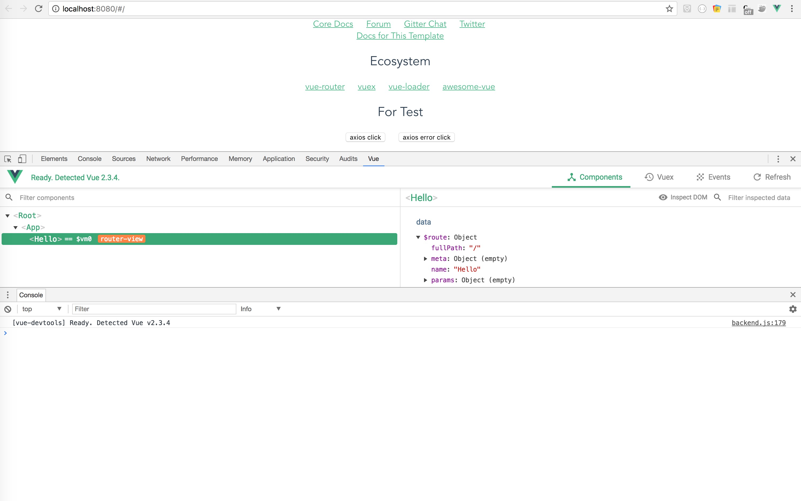

# HJPaaSHtml

> 和佳PaaS云平台，前端项目

> [项目帮助](doc/helper.md)

_已使用 eslint(standard) 强制严格按照标准编写_

## Build Setup

``` bash
# install cnpm
npm install -g cnpm --registry=https://registry.npm.taobao.org

# install dependencies
cnpm install

# serve with hot reload at localhost:8080
npm run dev

# build for production with minification
npm run build

# build for production and view the bundle analyzer report
npm run build --report

# run unit tests
npm run unit

# run e2e tests
npm run e2e

# run all tests
npm test
```

For detailed explanation on how things work, checkout the [guide](http://vuejs-templates.github.io/webpack/) and [docs for vue-loader](http://vuejs.github.io/vue-loader).


## Dependencies Document

### 1. vue v2
```text
#document
http://cn.vuejs.org/v2/guide/

```

### 2. vue-router
```text
#document
https://router.vuejs.org/zh-cn/
```

### 3. axios
```text
# document:
https://www.npmjs.com/package/axios

# global config
src/index.js

# interceptors
src/index.js

# proxyTable
config/index.js
```

### 4. element ui
```text
# document
http://element.eleme.io/#/zh-CN
```

### 5. mock data
```text
# use express 

# config
build/dev-server.js
  // serve mock data
  app.use('/mock', express.static('./mock'))
```

### 6. less
```text
# document
http://lesscss.cn/
```

### 7. nprogress
```text
# document
https://github.com/rstacruz/nprogress
```


## Other

### 1. vue-devtools

```text
# vue-devtools
https://github.com/vuejs/vue-devtools

# for chrome plug-in
doc/vue.js_devtools-3.1.5.crx
```
